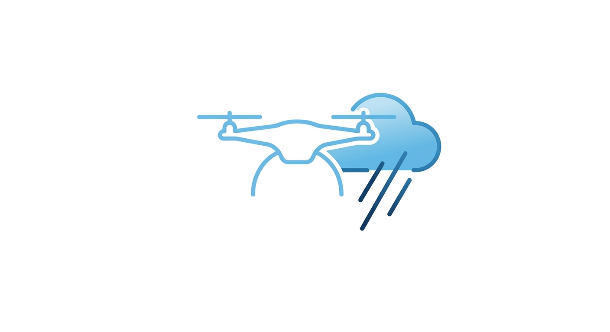

# 🛸 Drohnenwetter

Echtzeit-Wetter- und Luftraumbeurteilung für **DJI Matrice 30T (M30T)** Drohnen-Piloten in Deutschland.

🇬🇧 [English version](README.en.md)

[](https://github.com/olizimmermann/drohnenwetter/actions/workflows/daily-health.yml)



---

## Funktionen

- **Sicherheitsbewertung** — Windgeschwindigkeit (je Höhe), Böen, Temperatur, Taupunkt und geomagnetische Aktivität werden gegen die M30T-Betriebsgrenzen geprüft
- **Luftraumüberlagerung** — DiPUL/DFS WMS mit 32 Zonentypen (Kontrollzonen, Naturschutzgebiete, Militärgebiete, …)
- **Betroffene Zonen** — API-basierte GeoJSON-Polygone für den genauen Standort, auf der Karte dargestellt mit Popups und Klick-Details
- **Wolkenuntergrenze** — nächstgelegenes Flughafen-TAF wird nach Wolkenuntergrenze ausgewertet
- **Luftverkehr live** — Flugzeuge in der Nähe (✈️ Starrflügler, 🚁 Hubschrauber, 🛩 Segelflugzeuge, 🛸 UAVs) über das OpenSky-Netzwerk, alle 15 Sekunden aktualisiert
- **Parallele API-Abfragen** — alle Datenquellen werden gleichzeitig abgerufen (UTM, OpenWeatherMap, Kp-Index, DiPUL, OpenSky)
- **Zweisprachig** — Deutsch/Englisch umschaltbar, wird in localStorage gespeichert
- **Hell- & Dunkelmodus** — umschaltbar, wird in localStorage gespeichert
- **Mobiloptimiert** — responsives Grid, touchfreundliche Bedienung, 16px-Eingaben (kein iOS-Autozoom)
- **Rate Limiting** — 10 Anfragen / Minute pro IP, Token-Bucket via `golang.org/x/time/rate`

---

## Datenquellen

| Quelle | Daten |
|--------|-------|
| [DFS UTM](https://utm.dfs.de) | Wind- & Temperaturvorhersage auf 10 / 50 / 100 / 150 m AGL |
| [OpenWeatherMap](https://openweathermap.org) | Aktueller Taupunkt |
| [GFZ Potsdam](https://www.gfz-potsdam.de) | Kp-Index (geomagnetische Aktivität) |
| [DiPUL / DFS](https://uas-betrieb.de) | Luftraumzonen, WMS-Überlagerung & Zonendetails |
| [DFS TAF](https://www.dfs.de) | Wolkenuntergrenze vom nächstgelegenen Flughafen-TAF |
| [OpenSky Network](https://opensky-network.org) | Echtzeit-Luftverkehr (State Vectors, ~11 km Radius) |
| [HERE Maps](https://www.here.com) | Adress-Geocoding (nur Deutschland) |
| [OpenStreetMap](https://www.openstreetmap.org) | Kartenkacheln |
| [Leaflet](https://leafletjs.com) | Interaktive Karte |

---

## Sicherheitsgrenzen (DJI M30T)

| Parameter | Grenzwert |
|-----------|-----------|
| Windgeschwindigkeit | ≤ 12 m/s je Höhenstufe |
| Böen | ≤ 12 m/s |
| Temperatur | −20 °C … +50 °C |
| Taupunkt-Abstand | > 2 °C (Nebelrisiko unter 7 °C) |
| Kp-Index | ≤ 4 (GPS- / Funk-Zuverlässigkeit) |

---

## Technologie

- **Sprache:** Go 1.23 — `net/http`, `html/template`, kein Web-Framework
- **Version:** `0.8` (siehe [VERSION](go/VERSION))
- **Abhängigkeiten:** [`golang.org/x/time/rate`](https://pkg.go.dev/golang.org/x/time/rate) (Rate Limiting)
- **Karte:** Leaflet.js + OpenStreetMap + DiPUL WMS
- **Betrieb:** Docker Compose — 3 App-Replikas + Nginx Reverse Proxy
- **Image:** Multi-Stage-Build → `gcr.io/distroless/static-debian12:nonroot` (~8 MB)
- **Proxy:** Cloudflare → Nginx → Go-App (echte IP via `CF-Connecting-IP`)

---

## Projektstruktur

```
drohnenwetter/
├── go/                          # Go-Anwendung
│   ├── cmd/drone-weather/
│   │   └── main.go              # Einstiegspunkt, Server, Rate Limiting, Middleware
│   ├── internal/
│   │   ├── api/
│   │   │   ├── client.go        # HTTP-Client (8 s Timeout)
│   │   │   ├── geocode.go       # HERE Maps Geocoding
│   │   │   ├── weather.go       # DFS UTM + OpenWeatherMap + Kp-Index
│   │   │   ├── dipul.go         # DiPUL Token-Cache + Zonenabruf
│   │   │   ├── wms.go           # DiPUL WMS GetFeatureInfo (Klick-Details)
│   │   │   ├── metar.go         # Wolkenuntergrenze aus Flughafen-TAF
│   │   │   └── opensky.go       # OpenSky OAuth2 Token-Cache + Verkehrsabruf
│   │   ├── assessment/
│   │   │   └── assess.go        # Sicherheitsbewertungslogik
│   │   └── handler/
│   │       ├── home.go          # GET /
│   │       ├── results.go       # POST /results — paralleler Abruf & Rendering
│   │       ├── zone-info.go     # GET /zone-info — Zonenklick-Details (GeoJSON)
│   │       ├── traffic.go       # GET /traffic — Live-Luftverkehr JSON
│   │       ├── track.go         # GET /track — Flugtrack-Proxy
│   │       └── util.go          # Gemeinsame Handler-Hilfsfunktionen
│   ├── templates/
│   │   ├── base.html            # Gemeinsames CSS, Hell/Dunkel-Modus, i18n, Footer
│   │   ├── index.html           # Startseite
│   │   ├── results.html         # Dashboard: Messwerte, Karte, Zonen, Luftverkehr
│   │   ├── impressum.html       # Impressum
│   │   └── datenschutz.html     # Datenschutzerklärung
│   ├── static/                  # Favicons, Manifest, robots.txt, Sitemap
│   ├── Dockerfile
│   ├── go.mod
│   └── go.sum
├── nginx/
│   └── drohnenwetter.de.conf
├── checks/
│   └── smoke.sh                 # Smoke-Tests gegen Live-Site
├── .github/
│   └── workflows/
│       └── daily-health.yml     # Täglicher automatischer Health-Check (07:00 UTC)
├── docker-compose.yml
└── .env                         # API-Keys (nicht eingecheckt)
```

---

## Einrichtung

### Voraussetzungen

- Docker + Docker Compose
- API-Keys (siehe unten)

### Umgebungsvariablen

`.env`-Datei im Projektverzeichnis anlegen:

```env
HERE_API_KEY=dein_here_maps_api_key
OPENWEATHER_TOKEN=dein_openweathermap_api_key
OPENSKY_CLIENT_ID=deine_opensky_client_id
OPENSKY_CLIENT_SECRET=dein_opensky_client_secret
```

| Variable | Bezugsquelle |
|----------|-------------|
| `HERE_API_KEY` | [developer.here.com](https://developer.here.com) — kostenlose Stufe verfügbar |
| `OPENWEATHER_TOKEN` | [openweathermap.org/api](https://openweathermap.org/api) — OneCall 3.0 erforderlich |
| `OPENSKY_CLIENT_ID` | [opensky-network.org](https://opensky-network.org) — API-Client unter dem eigenen Konto anlegen |
| `OPENSKY_CLIENT_SECRET` | Wie oben — OAuth2 Client Credentials Flow |

> `OPENSKY_CLIENT_ID` und `OPENSKY_CLIENT_SECRET` sind optional. Ohne diese Angaben fällt die App auf die anonyme OpenSky-API zurück (niedrigere Rate Limits, keine Track-Daten).

### Starten

```bash
docker compose up --build
```

Die App ist danach unter **http://localhost:8080** erreichbar.

### Logs

```bash
docker compose logs -f drohnenwetter-app
```

---

## Entwicklung

Go muss nicht lokal installiert sein — der Docker-Build übernimmt die Kompilierung.
Falls Go lokal vorhanden ist:

```bash
cd go
go build ./...                                    # Kompilierungsprüfung
HERE_API_KEY=... OPENWEATHER_TOKEN=... \
  OPENSKY_CLIENT_ID=... OPENSKY_CLIENT_SECRET=... \
  go run ./cmd/drone-weather                      # lokal starten auf :8080
```

### Smoke-Tests

```bash
./checks/smoke.sh                          # Live-Site testen
./checks/smoke.sh http://localhost:8080    # lokale Instanz testen
```

---

## Deployment

Das mitgelieferte `docker-compose.yml` betreibt **3 App-Replikas** hinter Nginx.
Konzipiert für den Betrieb hinter Cloudflare (echte Client-IP aus `CF-Connecting-IP`).

Live unter: [drohnenwetter.de](https://drohnenwetter.de)

> **Sicherheitshinweis:** Die App beendet kein TLS. Ausschließlich hinter Nginx + Cloudflare (oder einem anderen TLS-terminierenden Proxy) betreiben. Den Go-App-Port 8080 **nicht** direkt im Internet exponieren.

---

## Lizenz

Persönliches Projekt — ohne Gewähr. Kein Ersatz für offizielle Vorflugchecks.
Wetterdaten © jeweilige Anbieter. Kartendaten © OpenStreetMap-Beitragende.

---

**Kontakt:** [public@ozimmermann.com](mailto:public@ozimmermann.com) · [github.com/olizimmermann](https://github.com/olizimmermann)
